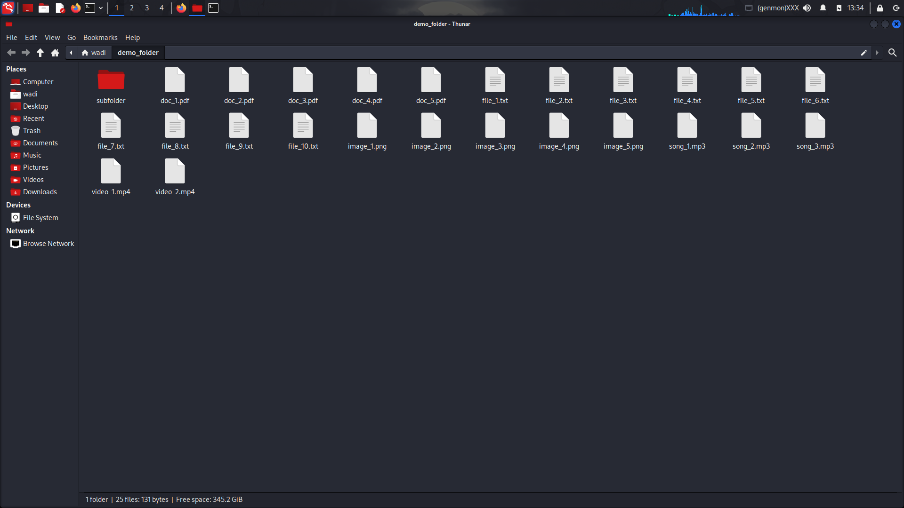
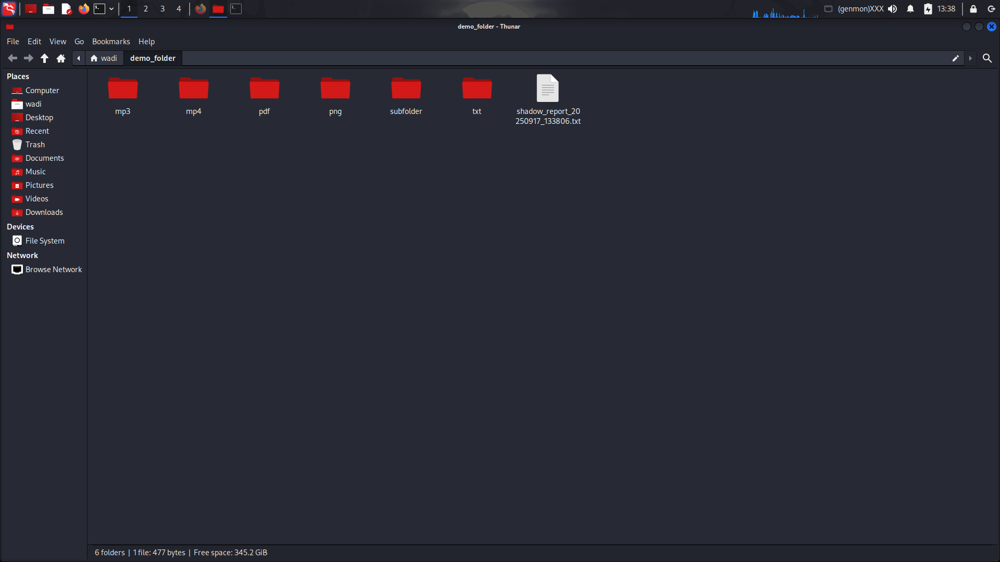
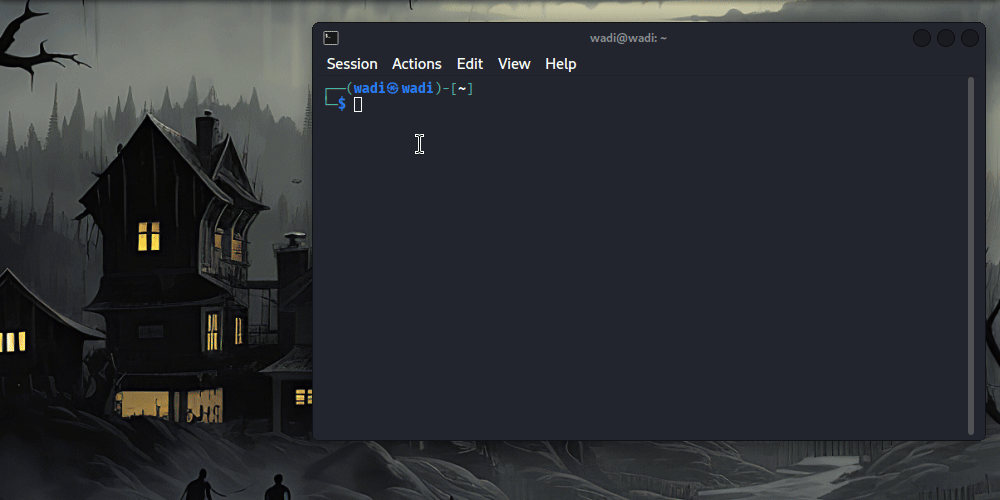

# ShadowAutomator 🪄 — One command to tame your messy folders

**Dark Python automation to transform chaos into clean, structured folders.**  
Before / After GIFs + rich terminal output = instant satisfaction.

---

## Features

- Automatically **sort files** by type, date, or custom rules
- **Smart renaming** for files: `ProjectA_YYYYMMDD`
- **Archive old files** automatically
- Generate **visual reports** (screenshots + GIFs) of transformations
- **Addictive CLI experience**: “cast spells” messages while organizing
- Optional **AI hints** to suggest smarter folder structures
- Cross-platform: works on Linux, macOS, Windows (with WSL/Python)

---

## Proof of Magic 🪄

Experience the ShadowAutomator transformation:

### 1️⃣ Before Chaos
Messy folder full of random files, unorganized, confusing.


### 2️⃣ After Order
After ShadowAutomator worked its magic — everything neatly organized.


### 3️⃣ Terminal Wizardry
Watch the CLI perform the folder “spell” in real-time.


### 4️⃣ Full Folder Transformation
See the complete folder structure reorganized magically.


---

## Quick Start

```bash
# Clone the repo
git clone https://github.com/your-username/shadow-automator.git
cd shadow-automator

# Make the script executable
chmod +x shadow_automator.py

# Preview mode (safe, dry-run)
./shadow_automator.py ~/path/to/messy --dry-run

# Real run (organizes files)
./shadow_automator.py ~/path/to/messy

# Cast mode (magical terminal output + archive + AI suggestions)
./shadow_automator.py ~/path/to/messy cast --archive-days 365 --ai
